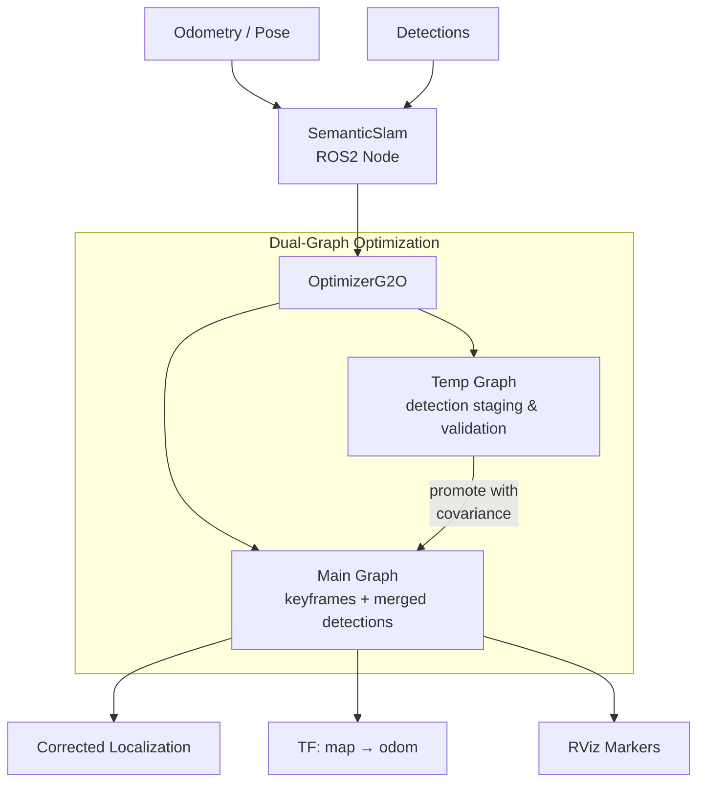

# DPS-SLAM: Dual Pose-graph Semantic SLAM

Semantic SLAM system for the [AeroStack2][aerostack2] UAV framework. It fuses odometry with semantic object detections using [g2o][g2o] pose-graph optimization.

## Features

- **Dual pose-graph optimization**: maintains a persistent global graph for long-term state estimation and a temporary graph that compresses multiple observations into a single optimized constraint, limiting graph growth while preserving detection information.
- **Semantic landmarks**: supports landmarks represented as full poses (6-DOF) or 3D points.
- **Fixed landmark anchoring**: allows known landmark positions to be configured as fixed references to reduce long-term drift.
- **Covariance propagation**: extracts per-node covariance estimates from graph marginals when promoting detections into the global graph.
- **ROS 2 support**: builds for ROS 2 Humble through `pixi-build-ros`.
- **TF integration**: publishes the corrected `map → odom` transform and localization estimates with covariance information.

## Installation

Requires [pixi][pixi].

```bash
git clone https://github.com/perezsaura-david/dps_slam.git
cd dps_slam
pixi install
```

This resolves all dependencies (ROS2, G2O, Eigen3, AeroStack2) through conda channels into the
default (Humble) environment.

## Usage

```bash
# Launch with default config
pixi run ros2 launch dual_pose_graph dual_pose_graph.launch.py

# Launch with a specific config and namespace
pixi run ros2 launch dual_pose_graph dual_pose_graph.launch.py \
    config_file:=config/config.yaml namespace:=drone1 use_sim_time:=false

# Run the node directly
pixi run ros2 run dual_pose_graph dual_pose_graph_node \
    --ros-args --params-file config/config.yaml

# Rebuild after code changes
pixi reinstall ros-humble-dual-pose-graph
```

## Configuration

The node takes a single YAML parameter file, passed via `config_file:=` at launch or `--params-file`
when run directly. A ready-to-use, well-tuned `config/config.yaml` ships with the package and is loaded
by default. The parameters below are grouped by role.

### Topics

| Parameter | Description |
|---|---|
| `odometry_topic` | `nav_msgs/Odometry` motion input. |
| `pose_topic` | `geometry_msgs/PoseStamped` motion input, used instead of odometry when set (leave empty to disable). |
| `detections_topic` | `as2_msgs/PoseStampedWithIDArray` semantic detections (ArUco markers / gates). |
| `corrected_localization_topic` | Output `geometry_msgs/PoseWithCovarianceStamped` corrected pose. |
| `corrected_path_topic` | Output `nav_msgs/Path` of corrected poses. |
| `viz_main_markers_topic` / `viz_temp_markers_topic` | RViz `MarkerArray` outputs for the main and temp graphs. |

### Frames

| Parameter | Description |
|---|---|
| `map_frame` / `odom_frame` / `robot_frame` | TF frame names for the map, odometry, and robot body. |
| `earth_to_map.{x,y,z,roll,pitch,yaw}` | Static transform from the earth (GPS) frame to `map_frame`. |
| `generate_odom_map_transform` | Publish the corrected `map → odom` TF. |

### Keyframing

| Parameter | Description |
|---|---|
| `main_graph_odometry_distance_threshold` | Motion (m) before a new keyframe is added to the main graph. |
| `main_graph_odometry_distance_threshold_if_detections` | Distance threshold used while detections are present (usually tighter). |
| `main_graph_odometry_orientation_threshold` | Rotation (deg) that also triggers a main-graph keyframe. |
| `temp_graph_odometry_distance_threshold` / `temp_graph_odometry_orientation_threshold` | Equivalent thresholds for the temporary graph. |
| `odometry_is_relative` | `true` if odometry messages are incremental deltas rather than absolute poses. |

### Map → Odom Transform

| Parameter | Description |
|---|---|
| `map_odom_transform_alpha` | Smoothing of the `map → odom` update: `1.0` applies it directly, `< 1.0` low-pass filters it (slerp on rotation). |
| `map_odom_security_threshold` | Safety bound on how far the correction may jump in a single update. |
| `calculate_odom_covariance` | Estimate odometry-edge covariance from the graph. |
| `visualize_graphs` | Publish the RViz marker arrays. |

### Detections

| Parameter | Description |
|---|---|
| `detection_covariance_factor` / `detection_orientation_covariance_factor` | Base scale of position / orientation measurement covariance. |
| `detection_covariance_by_distance` / `detection_covariance_by_distance2` | Inflate detection covariance linearly / quadratically with range. |
| `generate_orientation_cov_by_distance` | Inflate orientation covariance beyond a range. |
| `distance_for_orientation_covariance_increment` | Range (m) past which the inflation applies. |
| `detection_orientation_covariance_large_factor` | Factor applied when inflating orientation covariance. |
| `throttle_detections` | Rate-limit detection processing. |
| `use_dual_graph` | `true` routes detections through the temp graph; `false` (recommended) merges them directly into the main graph. |
| `force_object_type` | Treat every detection as this type (`"aruco"` or `"gate"`). |

### Fixed Objects

Known landmark positions can be anchored in the graph as fixed references to reduce long-term drift:

```yaml
fixed_objects:
  gate_1:
    type: "aruco"        # or "gate"
    pose: [4.0, 1.3, 1.13, 0.0]   # [x, y, z, yaw]
```

## Architecture



The optimizer uses G2O's Levenberg-Marquardt algorithm with a CHOLMOD sparse linear solver.
Keyframes are inserted into the main graph when the robot moves beyond a configurable distance
threshold. Detections accumulate in the temporary graph and are promoted (with covariance) to
the main graph at each new keyframe, then the temporary graph resets.

## License

BSD-3-Clause. See [LICENSE][license].

[aerostack2]: https://github.com/aerostack2
[g2o]: https://github.com/RainerKuemmerle/g2o
[pixi]: https://pixi.sh
[license]: LICENSE
